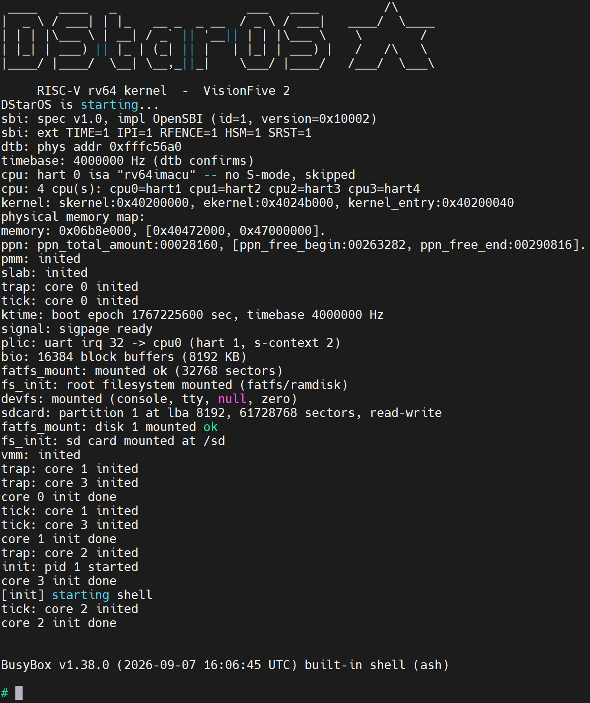

# DStarOS

中文 | [English](README.en.md)

RISC-V rv64 内核，运行在 QEMU `virt` 与 StarFive VisionFive 2（JH7110）实机上，用户态跑 BusyBox。



## 快速开始

宿主机装好 Docker 后，在仓库根目录：

```bash
docker compose up -d          # 首次会构建开发镜像
docker compose exec dev bash  # 进入容器
make && make -C user && bash tools/build_busybox.sh && make rootfs
bash scripts/run.sh           # 进入 BusyBox shell；Ctrl-A X 退出 QEMU
```

各步骤的说明见下文。

## 支持功能

- **内存管理**：物理页 best-fit 分配，释放时按地址合并相邻空闲块；slab 分配器承接 `kmalloc`；Sv39 三级页表，
  用户态按需分页，`fork` 写时复制（COW）
- **进程与调度**：多核（QEMU 默认 4 核，VF2 4 个 U74），调度类分 CFS、RT、idle 三层；`fork`/`execve`/`wait4`、
  ELF 加载
- **文件系统**：Linux 风格的 VFS 四层（super_block / inode / dentry / file），LRU 目录项缓存；FatFS 挂在
  RAM 盘（`/`）与 VF2 的 SD 卡（`/sd`），devfs（`/dev`）；块设备层带 LRU 块缓存
- **进程间通信**：管道，POSIX 信号（含 sigreturn 跳板页）
- **终端**：TTY 行规范与 termios
- **用户态**：musl 静态链接程序，BusyBox ash 作为交互 shell，`/sbin/init` 作为 1 号进程
- **平台**：QEMU `virt`；VF2 实机（UART、PLIC、SD 卡驱动、设备树解析）

## 开发环境

### 前置要求

宿主机只需要 Docker（含 Compose 插件；Windows 上用 Docker Desktop）。工具链、QEMU、GDB 全部装在镜像里。
首次构建镜像要下载工具链等内容，需要联网，耗时较长。

### 创建容器

构建与 QEMU 都在 Docker Compose 的 `dev` 服务容器里进行，源码以卷挂载进容器，宿主机上的修改即时可见。
在仓库根目录执行：

```bash
docker compose up -d
```

镜像 `riscv-os-devkit:v5` 不存在时会按 `docker/Dockerfile` 自动构建（也可以先单独 `docker compose build`）；
重复执行不会报错。更新镜像后用 `docker compose up -d --force-recreate` 重建容器。

镜像（Ubuntu 24.04）中包含：

| 组件 | 用途 |
|---|---|
| `gcc-riscv64-unknown-elf`（GCC 13，Ubuntu 软件源） | 编译内核 |
| Bootlin `riscv64-lp64d--musl--stable`（`riscv64-linux-gcc`） | 编译 `user/` 下的 musl 程序与 BusyBox |
| `qemu-system-riscv64`（8.2，自带 OpenSBI v1.3） | 运行内核 |
| `gdb-multiarch` + GEF | 调试内核 |

进入容器（在仓库根目录执行，进去即位于容器内的仓库根目录）：

```bash
docker compose exec dev bash
```

以下命令除注明"U-Boot"的以外，都在容器内的仓库根目录执行。

### SBI 固件

内核运行在 S 态，依赖 M 态的 SBI 固件完成多核启动、关机等操作。两个平台都不需要自己准备固件：

- **QEMU**：使用 QEMU 自带的 OpenSBI（`-bios default`）。想换成其它固件（例如
  [RustSBI](https://github.com/rustsbi/rustsbi)），运行时指定 `SBI_BIOS=<固件文件> bash scripts/run.sh`。
- **VF2**：使用板载 flash 里出厂的 OpenSBI v1.2 + U-Boot，不替换。

## 在 QEMU 上构建与运行

```bash
make                          # 内核：build/kernel.elf、build/kernel.bin
make -C user                  # 用户程序：user/*.elf
bash tools/build_busybox.sh   # BusyBox：build/busybox（首次运行自动下载 1.38.0 源码）
make rootfs                   # 根文件系统镜像：build/rootfs.img（用户程序 + BusyBox）
bash scripts/run.sh           # 启动 QEMU（默认 4 核；SMP=2 bash scripts/run.sh 改核数）
```

退出 QEMU：`Ctrl-A` 然后 `X`。

- 用户程序与 BusyBox 只在其源码或配置变化时需要重编；改内核只需重新 `make`。
- 没有 `build/rootfs.img` 时 QEMU 照样能起，内核会现场格式化一张空盘，但进不了 BusyBox。
- BusyBox 源码下载失败时（例如访问不了 busybox.net），脚本会改从 GitHub 镜像克隆；都不通时会提示手动下载的命令。

## 使用 shell

启动后 `/sbin/init` 拉起 BusyBox ash，提示符为 `#`。`exit` 退出 shell 后 init 会重新拉起一个。

根文件系统内容：`/bin/busybox` 与用户态测试程序（`/bin/*.elf`，可直接按名字运行，如 `hello.elf`）、
`/sbin/init`、`/dev`（`console`、`tty`、`null`、`zero`）、`/etc`、`/tmp`；VF2 上 SD 卡的 FAT 分区挂在 `/sd`。

BusyBox 按本内核的能力裁剪（配置见 `configs/busybox_dstar.config`），只编入了以下命令：

`cat` `cp` `echo` `false` `ls` `mkdir` `mv` `pwd` `rm` `rmdir` `sleep` `true` `uname`，以及 `sh`（ash）

加上 ash 内建的 `cd`、`exit`、`export`、`set`、`shift`、`trap` 等。内建的 `read` 与 `wait` 依赖内核尚未实现的
`ppoll`、`rt_sigsuspend`，不可用：`read` 读不到输入，`wait` 会卡住并刷屏 `syscall: unknown nr=133`。

shell 语法方面：

| 支持 | 不支持 |
|---|---|
| 管道 `a \| b` | 作业控制：`Ctrl-Z`、`fg`、`bg`、`jobs` |
| 重定向 `>` `>>` `<`、here-document `<<` | 命令行编辑：历史、方向键、Tab 补全 |
| `;` `&&` `\|\|`，后台运行 `&` | 算术展开 `$((...))`；等待后台进程的 `wait` |
| `if` `for` `while` `case`、函数 | `test` / `[ ]`（条件判断可以用命令的退出状态代替） |
| 变量、命令替换 `$(...)`、通配符 `*` | `alias`、`printf` |

**不支持关机**：BusyBox 没有编入 `poweroff`/`reboot`，内核也没有实现 `reboot` 系统调用。QEMU 用 `Ctrl-A X` 退出；
VF2 直接断电或按 RST 键。

## 使用 GDB 调试内核

一个终端启动 QEMU 并停在第一条指令：

```bash
bash scripts/forgdb.sh
```

另开一个终端进入容器，连接 GDB：

```bash
docker compose exec dev bash
gdb-multiarch build/kernel.elf -ex 'target remote :1234'
```

镜像里的 GDB 已加载 GEF 插件。内核链接在高地址，在 MMU 打开之前（`startup.S`、`os_init_before_mmu_enable`）
按符号下断点不会命中，可以先在 `os_init_after_mmu_enable` 处下断点。

## 回归测试

回归测试依赖串口输出判定结果。`src/debug/debug.h` 里的 `DEBUG_SUITE` 选择编进内核的测试套件，
取值是套件名大写加 `SUITE_` 前缀；`SUITE_NONE` 是交付形态，1 号进程为 `/sbin/init`。

```bash
bash scripts/regress_all.sh        # 一次跑完全部 19 套，自动切换开关并复位
bash scripts/regress_all.sh mem bb # 只跑指定几套
RUNS=3 bash scripts/regress_all.sh # 每套重复 3 次

# 也可以手动跑单套，例如 mem：
#   1. 把 debug.h 里的 DEBUG_SUITE 改成 SUITE_MEM
make
bash scripts/regress.sh mem        # 可加次数：bash scripts/regress.sh mem 5
#   2. 跑完改回 SUITE_NONE
```

用户态套件依赖 `user/*.elf`，`mroot` 与 `bb` 还依赖 `build/rootfs.img`，先按上一节准备好。

| 套件 | 运行于 | 内容 |
|---|---|---|
| `sched` | 内核态 | 调度类、信号量、等待队列、管道 |
| `slab` | 内核态 | slab 分配器 |
| `dcache` | 内核态 | LRU 目录项缓存 |
| `vfs` | 内核态 | VFS/FatFS、getcwd、挂载 |
| `file` | 用户态 | POSIX 文件 syscall，含双进程并发 |
| `pipe` | 用户态 | 管道 |
| `tty` | 用户态 | 行规范与 termios（输入由 QEMU 的 stdin 喂入） |
| `mem` | 用户态 | brk/mmap/munmap 与 COW |
| `exec` | 用户态 | dup 与 execve |
| `sig` | 用户态 | 信号 |
| `time` | 用户态 | 时间与杂项 syscall、execve 传 argv/envp |
| `seg` | 用户态 | 相邻 PT_LOAD 段共用一页 |
| `wait` | 用户态 | wait4 的 pid 选择与 WNOHANG、F_DUPFD |
| `trap` | 用户态 | 用户态同步异常只杀掉该进程 |
| `musl` | 用户态 | musl 启动路径 |
| `msys` | 用户态 | 以 musl 程序覆盖 syscall |
| `mroot` | 用户态 | rootfs 镜像内容可读 |
| `mfp` | 用户态 | 浮点上下文保存与恢复 |
| `bb` | 用户态 | BusyBox 冒烟命令串 |

- 通过时输出形如 `[mem] run 1: === memtest done: 54 pass  0 fail ===`；失败时打印 `FAILED` 及原因，
  完整串口日志存到容器的 `/tmp/regress-<套件>-<次>-fail.log`。
- 提交代码前确认 `DEBUG_SUITE` 已复位为 `SUITE_NONE`。

## 在 VF2 实机上运行

```bash
make vf2img    # 以 PLATFORM=VF2 全量重建，产出 build/vf2-kernel.img（会校验 Image 头）
make rootfs    # 根文件系统与 QEMU 共用同一个 build/rootfs.img
```

板子使用出厂固件，不替换；SD 卡只需要一个 FAT 分区，放 `vf2-kernel.img` 与 `rootfs.img`。

需要准备：SD 卡、USB 转 TTL 串口线（接板子的调试串口，115200 8N1）；走 TFTP 时还需要一根网线。

### 设置 U-Boot 环境变量（只做一次）

上电后在倒计时（2 秒）内按任意键进入 U-Boot，设置下面几个变量，最后 `saveenv`：

| 变量 | 内容 | 用途 |
|---|---|---|
| `bootcmd` | `run dstar_sd` | 上电默认从 SD 卡启动 |
| `dstar_sd` | `fatload mmc 1:1 0x40200000 vf2-kernel.img && fatload mmc 1:1 0x47000000 rootfs.img && booti 0x40200000 - ${fdtcontroladdr}` | 内核与 rootfs 都从 SD 卡读 |
| `dstar` | `tftpboot 0x40200000 vf2-kernel.img && tftpboot 0x47000000 rootfs.img && booti 0x40200000 - ${fdtcontroladdr}` | 内核与 rootfs 都走 TFTP |
| `dstar_t` | `tftpboot 0x40200000 vf2-${suite}.img && fatload mmc 1:1 0x47000000 rootfs.img && booti 0x40200000 - ${fdtcontroladdr}` | 板上回归：测试内核走 TFTP，rootfs 读 SD 卡 |

例如：

```
setenv dstar_sd 'fatload mmc 1:1 0x40200000 vf2-kernel.img && fatload mmc 1:1 0x47000000 rootfs.img && booti 0x40200000 - ${fdtcontroladdr}'
setenv bootcmd 'run dstar_sd'
saveenv
```

在 U-Boot 里改变量时注意以下几点，它们出错都**不会报错**：

- 值要用单引号括起来，否则 `${fdtcontroladdr}` 会在 `setenv` 时就被展开；
- 串联命令用 `&&`，不要用 `;`——`;` 会吞掉前一步的失败，最后只看到一句不相干的 `Bad Linux RISCV Image magic!`；
- `setenv` 后面必须紧跟变量名，只给一个参数等于删除变量；
- 定义完变量，**在 `run`、`booti` 或断电之前先 `saveenv`**，否则重新上电就没了。

### 从 SD 卡启动

把 `build/vf2-kernel.img` 与 `build/rootfs.img` 拷进 SD 卡的 FAT 分区，插卡上电，`bootcmd` 会自动执行
`run dstar_sd`。

### 日常迭代（TFTP）

宿主机准备（只做一次）：

- 有线网卡设静态 IP，例如 `192.168.120.100/24`，**不设网关**（否则会抢走默认路由）；
- TFTP 服务（如 tftpd64）根目录指向仓库的 `build/`，监听接口选这张有线网卡；防火墙放行 UDP 69；
- 在 U-Boot 里设置 `ipaddr=192.168.120.230`、`serverip=192.168.120.100`、`tftpwindowsize=8`（按自己的网络修改）并 `saveenv`。

每轮迭代：

1. 容器里 `make vf2img`；
2. 板子上电，倒计时内按任意键进入 U-Boot；
3. `run dstar`。

### 更新 SD 卡里的内核或 rootfs

不用拆卡，在 U-Boot 里通过 TFTP 拉取后写进卡里，再读回核对：

```
tftpboot 0x40200000 vf2-kernel.img && crc32 0x40200000 ${filesize}
fatwrite mmc 1:1 0x40200000 vf2-kernel.img ${filesize}
mw.b 0x40200000 0 ${filesize}
fatload mmc 1:1 0x40200000 vf2-kernel.img && crc32 0x40200000 ${filesize}
```

两次 `crc32` 应一致。更新 rootfs 同理，把地址换成 `0x47000000`、文件名换成 `rootfs.img`。

### 板上回归

1. 容器里打包测试镜像：

   ```bash
   bash tools/build_vf2_suites.sh            # 全部 19 套 → build/vf2-<suite>.img
   bash tools/build_vf2_suites.sh wait mfp   # 只重打指定的几套
   ```

   脚本逐个核对开关、告警、特征串与 CRC，最后输出 `=== all images verified ===` 才能上板；结束时会自动复位开关并重建交付镜像。

2. 板子插网线，倒计时内按键进入 U-Boot，每一套：

   ```
   setenv suite mem
   run dstar_t
   ```

3. 看串口上的 `done: N pass 0 fail` 收尾行，与 QEMU 的结果对照。测试跑完内核会停住（这版固件的 `sbi_shutdown` 不工作），按 RST 键或断电再上电开始下一套。

`tty` 套件需要从 stdin 喂一段精确的输入序列，板上手敲对不上，跳过。

### 恢复出厂启动方式

倒计时内按键进入 U-Boot：

```
setenv bootcmd 'run load_vf2_env;run importbootenv;run load_distro_uenv;run boot2;run distro_bootcmd'
saveenv
```

单引号必须保留——原值带分号，不加引号会被拆成几条命令当场执行。只想临时走一次 TFTP 的话，直接 `run dstar` 即可，不必改 `bootcmd`。

## 项目结构

```
.
├── compose.yaml          开发容器定义
├── docker/Dockerfile     开发镜像
├── makefile              内核构建（PLATFORM=QEMU|VF2）
├── lds/                  两个平台的链接脚本
├── configs/              BusyBox 配置片段
├── src/
│   ├── kernel/           内核主体（include/ 为头文件）
│   ├── lib/
│   │   ├── core/         设备树解析、SBI 调用、链表与红黑树
│   │   ├── drivers/      UART、PLIC、SD 卡、RAM 盘
│   │   ├── fatfs/        FatFS R0.11 与块设备适配
│   │   └── bsp/          tinyprintf 与 RISC-V CSR 定义
│   └── debug/            回归测试套件与调试开关（debug.h）
├── user/                 用户态测试程序与 init（musl 静态链接）
├── tools/                产物制作：rootfs、BusyBox、VF2 镜像
└── scripts/              运行入口：QEMU 启动、回归
```

主要功能与源文件（`src/kernel/` 下）的对应：

| 功能 | 文件 |
|---|---|
| 启动与初始化 | `startup.S`、`init.c`、`cpu.c` |
| 物理内存 | `pmm.c` |
| 内核堆 | `slab.c`、`kmalloc.c` |
| 虚拟内存、缺页、COW、用户内存访问 | `vmm.c`、`uaccess.c` |
| 进程、fork/exec | `proc.c`、`elf.c`、`cpua.S` |
| 调度 | `sched.c` |
| 同步原语 | `sync.c` |
| 中断、异常、系统调用 | `trap.c`、`syscall.c`、`tick.c`、`ktime.c` |
| 浮点上下文 | `fpu.c` |
| 信号 | `signal.c` |
| VFS 与目录项缓存 | `vfs.c` |
| FatFS 适配、挂载 | `fatfs_vfs.c`、`fs.c` |
| 块设备与块缓存 | `bdev.c`、`bio.c` |
| devfs、TTY、管道 | `devfs.c`、`tty.c`、`pipe.c`、`console.c` |

设计说明见 [doc/物理内存管理.md](doc/物理内存管理.md) 与 [doc/虚拟内存管理.md](doc/虚拟内存管理.md) 等 doc/ 文件夹下的文档。

## 已知限制

- 没有网络栈、没有 `/proc`；用户程序只支持静态链接（没有动态链接器）。
- 文件系统是 FAT：没有符号链接和权限位，文件名只支持 ASCII（支持长文件名）。
- 不支持关机：QEMU 用 `Ctrl-A X` 退出，VF2 断电或按 RST。VF2 出厂固件的 `sbi_shutdown` 也不工作，
  内核态测试跑完只能停住。
- shell 没有作业控制和命令行编辑，退格的回显不干净；`read`、`wait` 不可用，详见「使用 shell」一节。
- 在串口终端里粘贴超过 255 字节的单行时，输入会卡住，按 `Ctrl-U` 或 `Ctrl-C` 可以恢复。

## License

DStarOS 以 **GPL-3.0-or-later** 发布，全文见 [LICENSE](LICENSE)。

仓库中包含的第三方源码——Canaan K210 BSP、tinyprintf、Linux 的链表与红黑树、FatFs——
各自保留原作者的版权与许可证，逐一列在 [THIRD-PARTY.md](THIRD-PARTY.md)；涉及的许可证
全文存放在 `LICENSES/` 目录。

SBI 固件与 BusyBox 的源码和二进制均未包含在本仓库中。
